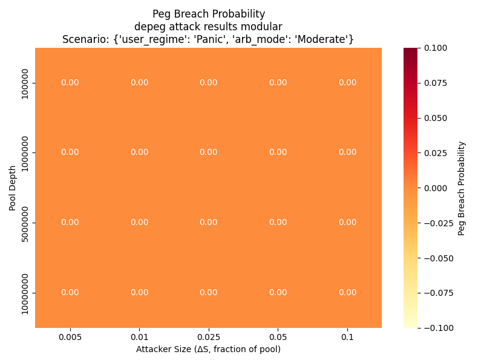

# Model Explainer: De-Peg Attack Simulation

This document explains the de-peg attack simulation model implemented in `depeg_attack_experiment.py`.

## Overview
We simulate a de-peg attack on a dual-token seigniorage stablecoin system using a constant-product AMM. The attacker dumps a large amount of stablecoin into the pool, and the simulation tracks whether the price breaches the peg for a sustained period.

## Key Model Features
- **AMM Pool Depths:** $100k, $1M, $5M, $10M
- **Attacker Size (ΔS):** 0.5%, 1%, 2.5%, 5%, 10% of pool
- **Simulation Tick:** 1 hour per tick
- **Attack Timing:** Attacker dumps at tick 21
- **User Trade Regimes:**
  - Normal: small, mean-zero noise
  - Panic: negative mean, higher variance
- **Arbitrage Response:**
  - Fast, Moderate (baseline), Slow
  - Moderate: 50% chance per tick, restores 60% of price gap
- **Peg Breach:** Price < 0.98 for 3 consecutive ticks
- **Monte Carlo:** 30 seeds per scenario

## Outputs
- Probability of peg breach for each scenario
- Minimum ΔS for ≥50% breach probability (Moderate+Panic)
- Heatmaps and sensitivity checks (to be added)

## Simulation Outputs and Analysis

### Heatmaps
For each scenario, we generate heatmaps showing the probability of a peg breach as a function of pool depth and attacker size (ΔS). The most policy-relevant scenario is the Panic user regime with Moderate arbitrage response.

Example heatmap (see `outputs/heatmap_depeg_attack_results_modular.png`):

### Minimum Attack Size Table
We also extract the minimum attacker size (ΔS) that yields a ≥50% probability of a peg breach for each pool depth. This is summarized in a CSV (see `outputs/min_attack_depeg_attack_results_modular.csv`).

| Pool Depth | Min ΔS for ≥50% Breach |
|------------|-----------------------|
| 100,000    | ...                   |
| 1,000,000  | ...                   |
| 5,000,000  | ...                   |
| 10,000,000 | ...                   |

*Replace ... with actual values after running the analysis script.*

---

All output files are located in the `experiments/outputs/` directory. These include:
- Heatmaps (`heatmap_*.png`)
- Minimum attack size tables (`min_attack_*.csv`)
- Full scenario results (`depeg_attack_results_*.csv`)

*Update this section as new results and visualizations are generated.*

## Limitations
- No swap fees, gas, off-DEX liquidity, or MEV
- Attacker assumed to already hold stablecoin

---

*This document will be updated as the model and results evolve.*
