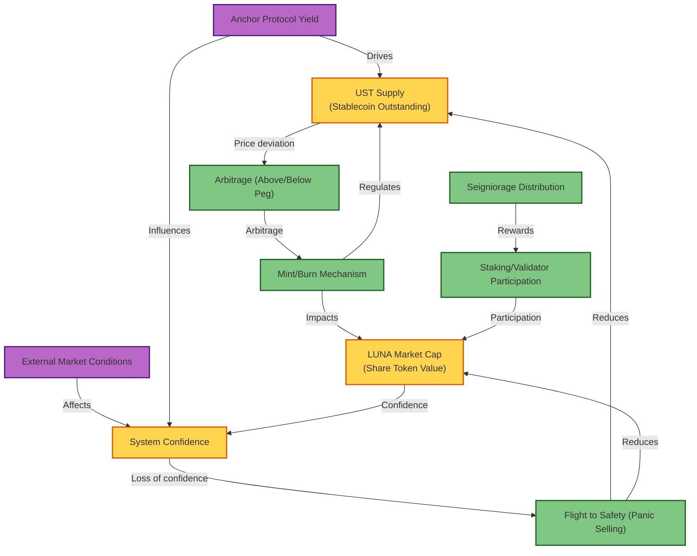
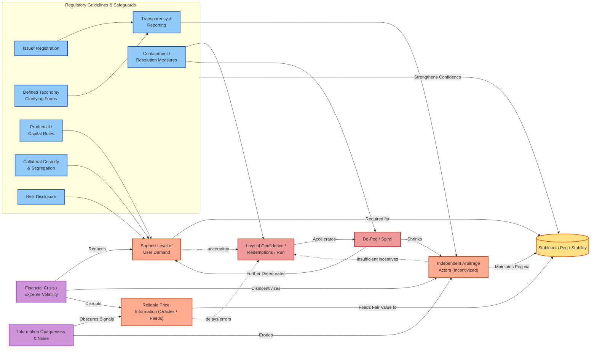

# Stock and Flow Diagram for Stablecoin System

---

**Summary:**
This diagram is a flowchart explaining the feedback dynamics of a stablecoin system (like Terra UST/LUNA). It includes:

- Stocks (UST supply, LUNA market cap, system confidence)
- Flows (mint/burn, arbitrage, seigniorage, staking, panic selling)
- External Inputs (market conditions, yield protocol)

Relationships between these elements are shown with directional and labeled arrows, modeling how confidence, supply, and market forces interact.

## Algorithmic Stablecoin Fragility & Safeguards

**Explanation:** This diagram encodes the passage: stability depends on (1) demand support, (2) incentivized arbitrage actors, (3) reliable price information. Crisis conditions and opacity weaken these, triggering runs and de-pegs. Regulatory safeguards mitigate root fragility channels to bolster peg stability.
