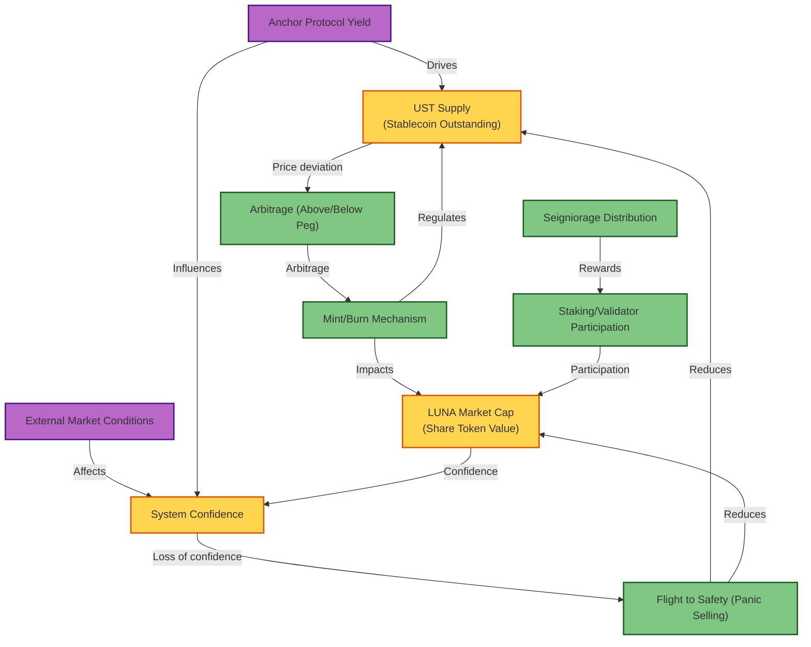

# Stock and Flow Diagram for Stablecoin System (Copy)

---

**Summary:**
This diagram is a flowchart explaining the feedback dynamics of a stablecoin system (like Terra UST/LUNA). It includes:

- Stocks (UST supply, LUNA market cap, system confidence)
- Flows (mint/burn, arbitrage, seigniorage, staking, panic selling)
- External Inputs (market conditions, yield protocol)

Relationships between these elements are shown with directional and labeled arrows, modeling how confidence, supply, and market forces interact.
